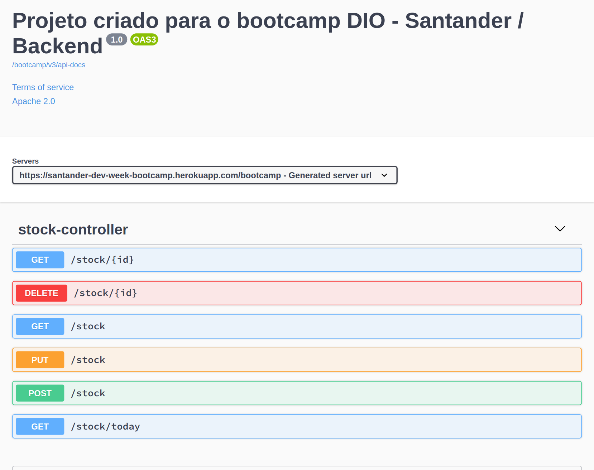

# Santander Dev Week Fullstack | Spring Boot
## Projeto Home Broker
---
Projeto em Spring Boot criado para o bootcamp DIO - Santander.

Clique em [swagger-ui](https://santander-dev-week-bootcamp.herokuapp.com/bootcamp/swagger-ui.html) para ver o backend em execução.

Clique em [homebroker](https://renoalencar.github.io/homebroker-frontend/) para ver o projeto **integrado** com o [frontend](https://github.com/renoalencar/homebroker-frontend).
---
## Mais informações
Esse Projeto foi gerado com [spring initializr](https://start.spring.io).

Features:
- Spring Web;
- Spring Boot Dev Tools;
- PostgreSQL Driver;
- Spring Data JPA;
- Validation;
- springdoc-openapi.